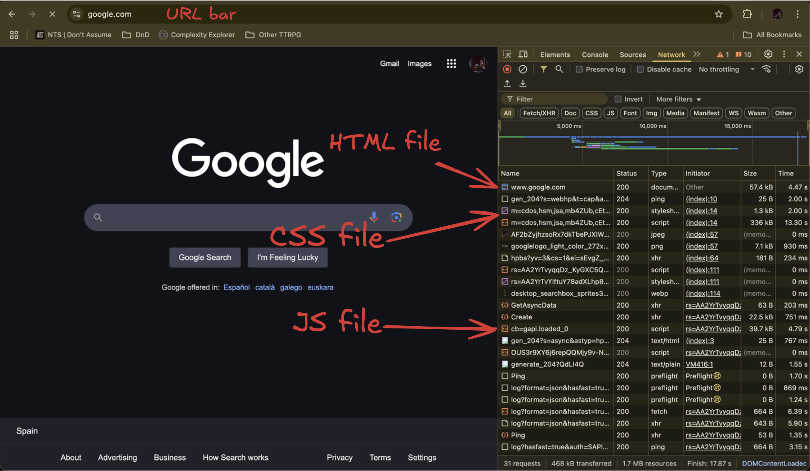
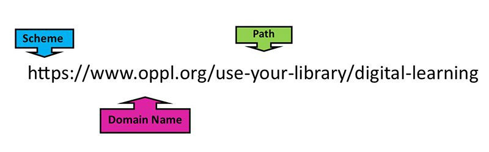
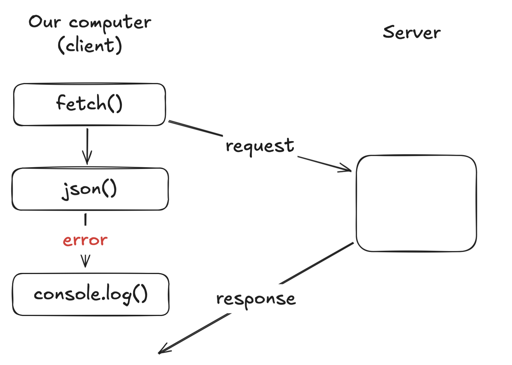
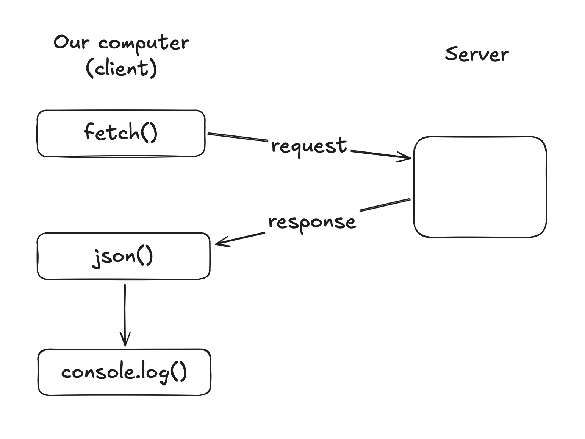
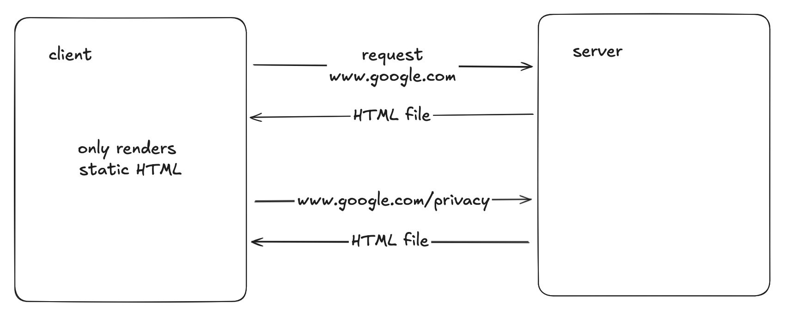
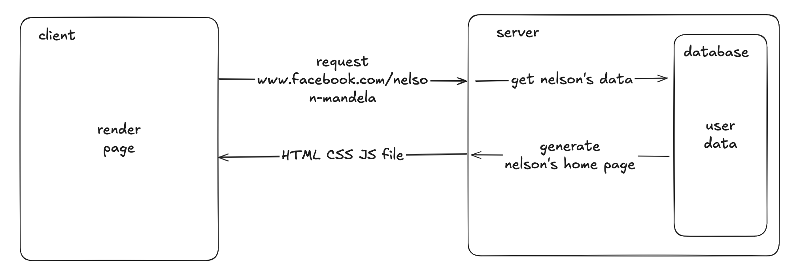
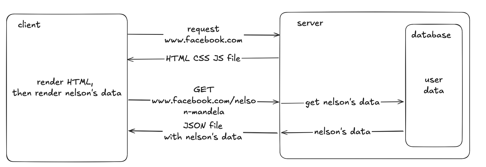

# Asynchronous JavaScript

## Intro

So far we've been writing HTML, CSS and JS in our computer and we open these files in our browser. The browser reads these files and shows the results on the screen. We're building websites, but right now we're the only ones able to see them. The beauty of the internet is that we can see any public website!

### Displaying a website

A website is nothing more than an HTML file along with it's corresponding CSS and JS files, and maybe some others like images or fonts. So if we want to see Google on our browser, how do we get those files?

When type a URL (like `https://www.google.com`) in the search bar and we hit `Enter`, we're downloading the HTML, CSS and JS files that Google gives us and the browser prints the content on the screen.
If we open the browser's inspector and navigate to the 'Network' tab, we can see all the files that the browser is downloading behind the scenes. It's downloading an HTML file first, along with a couple of CSS files, images, JS files, and more.



This communication works a little bit like going to a restaurant. There, we would tell the waiter what we want, the waiter then goes to the kitchen and tells the cooks what the order is, and when the food is ready, the waiter brings the food to our table.

In software development, we call this a _client/server architecture_. The browser is the **client**, which makes a **request** to a computer somewhere else in the world that has the files we're looking for. This remote computer is called the **server**, because it 'serves' the files when anyone requests them. And the **URL** tells the server what files do we want. A URL is the way we have of sending out a message from our computer to get some HTML files from a server. It has a different parts and can get complicated, but what we need to know for now is this:



The 'scheme' or 'protocol' is the language the two computers will use to talk to each other. If the client doesn't tell the server which protocol it's using, the server will get the request but won't 'understand' it.

The 'domain' is which like the house address of the server. This is to make sure our request gets to the server that has the files we're interested in, and not any other computer in the world!

The we have the 'path', which tells the server which files of the website we want. If there's no path, we're going to get the `index.html` file. But if there's a path we can tell the server we want some other page of the website. For example, if we click the 'Privacy' button in Google's homepage, we will navigate to `https://policies.google.com/privacy`. This request we just made is telling the server: I want the "Privacy" page in the "Policies" section of Google.

When we request a webpage, we'll get HTML files, but we can also get information we need in other formats.

## Talking to the server

To make requests from our JavaScript, we can use a simple [built-in function](https://developer.mozilla.org/en-US/docs/Learn_web_development/Core/Scripting/Network_requests): `fetch()`.
The first way to use it is by passing it a URL as it's argument. Here's a code example:

```js
const response = await fetch("https://pokeapi.co/api/v2/pokemon/pikachu");
const data = await response.json();
console.log(data);
```

> When we get and send information to and from a server, we usually use a file format called JSON. It's a text file that represents strings, numbers, booleans, objects & arrays. Many programming languages can read and write these type of files, which makes them a standard.

Someone in the world made a server with Pokemon information, and made it public so that anyone can use it. You can take a look at the documentation [here](https://pokeapi.co/), these are the instructions to use it. In the code above, we are asking the server (https://pokeapi.co), for the version 2 (/api/v2) of the Pokemon named Pikachu (/pokemon/pikachu).

In the first line, JS `fetch()` function will make the request, and if everything works, we will get a JSON file to the browser with the information.

The second line will take that JSON file and convert it to a JavaScript object for us to work with. As you can see, `response` itself is an object with more properties and methods, but using the method `json()` it's more than enough.
We can also see a new keyword: `await`

### Asynchrony

All the code that we've writen so far is **synchronous** code. This means that the computer reads it top to bottom and it executes it in order. You might call the function and declare it later, or a loop might repeat some code. But it never stops or waits.

A **request** (asking for data) to a server, takes some time, sometimes a lot. First the request has to leave our computer and travel to the server, wherever it might be in the world. Then the server has to read our request, process the information and send a **response** (the information we asked for).

If our website was completely blocked everytime this happens, it might be slow and hard to use. That's why JavaScript allows you to write code that won't block everything else: **asynchronous** code.

#### Promises

To do this, we can use JS [Promises](https://developer.mozilla.org/en-US/docs/Web/JavaScript/Guide/Using_promises). These are special objects that represent asynchronous operations. A Promise will be in one of these states: pending, fullfilled or rejected.

-   Pending: the computer is executing the asynchronous task.
-   Fullfilled: the task has been completed and it was successful.
-   Rejected: the task has been completed but it errored.

If we execute this code, we'll see an error saying that the method `json()` doesn't exist. Why?

```js
const response = fetch("https://pokeapi.co/api/v2/pokemon/pikachu");
const data = response.json();
console.log(data);
```

The `fetch()` function will return a promise, but if we don't use the word `await`, the computer will not wait for that promise to resolve (success or error). That _pending_ promise (unresolved) doesn't have the information from the server yet, so we can't use it.



If we use the `await` keyword, the computer will 'wait' for the request to be completed.
If you notice, we have to wait for the `json()` method as well. This is because computers break down in smaller 'chunks' to send them over the internet. The promise returned by `fetch()` will resolve when the first 'chunks' of the response arrive. The `json()` method returns a promise that will resolve when every chunk has arrived and we have all the data. (Don't worry about this. Just remember to await the `json()`)



> If we're writing the word `await` inside a function, we must write the word async at the function declaration, so that everyone knows that the function will run async code

```js
async function myRequest() {
    const res = await fetch(...);
    ...
}

// OR

const myRequest = async () => {
    const res = await fetch(...);
    ...
}
```

### HTTP

HTTP (Hypertext Transfer Protocol) is one of the languages there are to comunicate with servers, and the one we're going to use.

Along with URLs, there's another things we can use to talk to the server.

#### HTTP methods

##### GET

Imagine we're on YouTube. We go to the comment section of a video and the browser makes a request to the server to get all the comments for that video. This is a GET request. We make the request and say we want to GET the comments for this video.

##### POST

What if we write a new comment? We click "Send" and the browser makes a POST request to the server. POST is always used to create a new item. In the request we have to attach the information that we want to store. This is called the **body** of a request. It would look something like:

```js
const newComment = {
    user: "Zainab Al-Sayed",
    text: "This is a great video!",
};

const configuration = {
    method: "POST",
    headers: { "Content-Type": "application/json" },
    body: JSON.stringify(newComment),
};

fetch("https://example.com/api/endpoint", configuration);
```

Let's break this down:

-   First we have the new comment. This is the data we want to store in our server.
-   Then we have a configuration object with additional information about the request we want to make.
-   Lastly we have the `fetch()` function, with the URL we want and the configuration.

The configuration object:

-   Method: this indicates what type of action we want to take.
-   Headers: there's many headers in requests and responses. This is information about where it comes from, where it goes, user authorization, and so on. In this case we're saying that the type of content we're sending is a JSON file.
-   Body: the content that we want the server to store. Our `newComment` variable is a JavaScript object, but JSONs are text files, so we have to convert our object to text using `JSON.stringify()`.

> This can get confusing. There's libraries like [Axios](https://axios-http.com/docs/post_example) that simplify this process a little.

##### PUT/PATCH

They work like a POST request, but are meant to update already stored data.

Imagine we're on YouTube again. We go to settings and we can see our user info. Our user has already been created, but we want to change our email address. This would be made with a PUT or a PATCH request.

##### DELETE

Pretty self-explanatory. If we want to delete a user, comment, video, etc. this is what we use.

#### Query params

Imagine we're on Goggle and we search for 'cute cats'. We have to make a GET request (to get the search results) but GET requests don't have a body to pass information. We can use query params for this like:

```
https://www.google.com/search?q=cute+cats
```

You can see that we're reaching the `/search` endpoint and after the '?' sign we have `q=cute+cats`. 'q' is short for 'query'. They could have called it anything else, but it's a common standard.

We can pass other values like pagination for example. We might have millions of results with that search and if they try to send all of them at once everything would break. So we could do something like `?q=cute+cats&limit=20`, to search for the words 'cute cats' and get the first 20 results of the search.

> The 'q' does work in google, but the 'limit' param is an imaginary example. It's up to whoever designs the server to name the parameters it will accept.

## Extra

### Then/catch

This is another way of handling asynchrony. `then` will wait for the promise to be resolved and will execute the function passed as an argument. the `catch` function will run if the async operation throws an error.

```js
fetch("https://api.example.com/data")
    .then((response) => {
        return response.json(); // Parse the JSON from the response
    })
    .then((data) => {
        console.log("Data received:", data); // Handle the data
    })
    .catch((error) => {
        console.error("There was a problem with the fetch operation:", error);
    });
```

### Single Page Apps

Back in the 90's, the only way the web worked was:

1. The user typed a URL on the search bar (www.website.com)
2. The website's home page HTML file was downloaded and rendered on screen.
3. The user clicked a link to another page (www.website.com/about-us)
4. Again, the corresponding page's HTML file was downloaded and rendered on screen.
   ...



Then later websites got more complex, storing user data in a database in the server and generating HTML with that data which would then be sent to the client, which would render the files.



But with JavaScript and the browser getting more features, websites got more complex and started being more interactive. People started dynamically changing the HTML, without the need to load a new HTML page each time the user interacts (as we've seen in the DOM manipulation section of the course). This eventually grew into what we call SPAs (Single Page Applications). This is an architecture we only get one index.html page at the beginning and everything we see on the page is done through Javascript (which we'll do when we start using React).

In this last scenario, we still need information from the server. For example, if we log into Facebook, we see our own username, our profile picture, our friend's posts, etc. That is all information stored somewhere that's not our computer. And with JavaScript, we can get ask the information we need from the server.


