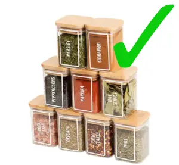
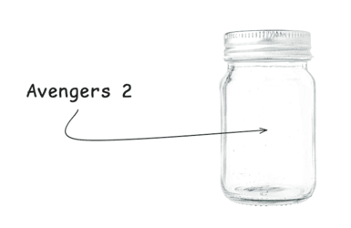
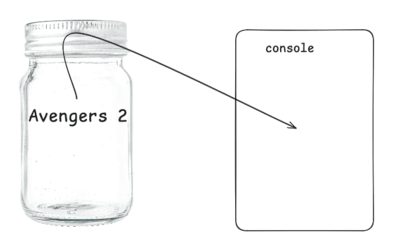

# Building blocks

Before extending the functionality of our website with JavaScript and manipulate the content of our website, we have to go through the basics of programming. The most fundamental building blocks are:

-   Variables
-   Conditionals
-   Loops
-   Functions

## Variables

JavaScript **variables** are containers for storing data values. The 3 containers that you need to keep in mind are: `var`, `const` & `let` ; and naming also plays an important role. This 📖 article [What is a variable?](https://developer.mozilla.org/en-US/docs/Learn/JavaScript/First_steps/Variables#what_is_a_variable), will give you a wide understanding of these concepts, and you will also find an introducction to **Arrays []** that we will cover further in more detail**.**

In programming, we're always working with data. Data is information. It can be a username, the number of likes a post has, the text in an email, a video file, etc. Anything you can see on a web page is data. For now we're going to work with data we create ourselves, but later on we will be working with data across the web!

Our first tool to handle data will be **variables**. But what are they?

Imagine you're cooking and you want to use pepper. If you have all your spices mixed together it would be very hard to find the ones you want.


But if we have containers for each one we can write names on each one and we can know what's inside of it by just looking at the name.



Variables are like containers. They help us work keep everything organized and make sure that we have access to our data in a clean and easy way.
In a variable we can store pretty much anything that the computer can understand, like text or number, as well as other more mysterious data that we will take a look at later.

To understand how to use them, first let's take a look at a some code:

```js
console.log("Hello world!");
```

If we run this code we will see something like this in our browser.


`console.log` will print whatever is in between the parenthesis - ( ) - to the console in our browser's developer tools.
What do you think this next code might do?

```js
let movie = "Avengers 2";

console.log(movie);
```

Going back to the spices analogy, imagine we have a container that we name _movie_ and we put the text inside of it.



And imagine in the next line we take that container, grab the content and we put it on the screen.



In technical terms we would say: in the first line we **declare** a variable called `movie` and then **assign** the **value** _Avengers 2_ to it. Then in the next line, we log the content of our variable to the console.

To **declare** a variable means to "create" a variable, to **assign** means to "store" some data inside it, and the **value** is the data that the variable will hold. Let's break down how we do it:

```js
let movie = "Avengers 2";
```

1. First we use the special word `let` to tell the computer that we want to create a variable.
2. Then we give our variable a name. This name can be (almost) anything, but there are a few rules. You can check out the bullet points in this [article](https://www.dummies.com/article/technology/programming-web-design/javascript/naming-javascript-variables-142522).
3. We use the "=" symbol. This will instruct the computer to store inside our variable whatever is on the right side of it.

📖 Try to create some variables with different texts and print all of them to the console.

We can also **re-assign** variables, like so:

```js
let movie = "Avengers 2";

movie = "Titanic";

console.log(movie);
```

📖 What do you think will happen? Try to run the code above.

```js
let movie = "Avengers 2";

console.log(movie);

movie = "Titanic";

console.log(movie);
```

📖 What about this one?

### Variable types

There's two main type types of variables: `let` & `const`. The difference is that while with `let` we can reassign the variable to a new value, with `const` we can't. Once we declare the variable, we won't be able to change the value inside it. Maybe now it doesn't make much sense but sometimes we want to make sure that some values don't change.

```js
const gravity = 9.8;
```

📖 Try to declare a `const` and reassign it. What does the console say?

There is a third variable type: `var`, but it's an old way of writing JavaScript and we don't need to worry about it. If you come across some code using it, just know that it's almost the same as `let`.

## Keywords, operators

In every programming language there's special words and symbols that the computer will understand as instructions.

```js
const myVar = "Hello world!";
```

We've seen that the words `let` & `const` will tell the computer that we want to create a variable.

These special words are called **keywords** and they're reserved for the language to use. If we try to use them for other purposes, like naming variables, we will get an error.

```js
const let = 2; // SyntaxError
```

When these words and symbols are instructions, they are called **operators**. For example, the symbol `=` will express that we want to assign the value on the right ('Hello world!') to the variable we're creating (myVar).

## Data types

There is a set of different types of values JavaScript will understand:

-   **Number**
    -   It can be an integer (a number without decimals. Ex: 34) or a float (a number which can have decimals. Ex: 34.245). It must be between -9007199254740991 and 9007199254740991.
-   **String**
    -   Text. A sequence of characters. A character can be a letter ('a'), a sign ('?'), an emoji ('😃'), ...
-   **Boolean**
    -   `true` or `false`. A simple _yes_ or _no_.
-   **Undefined**
    -   It represents a missing value. If you try to log a variable with no value assigned, it will log `undefined`.
-   **Null**
    -   Very similar to `undefined`. It also represents a missing value but it has some very minor differences.

There are two more advanced types. It's not necessary to get into them:

-   **BigInt**
    -   If you need values bigger than 9007199254740991 or smaller than -9007199254740991, this is the data type for those.
-   **Symbol**
    -   A unique value. Useful if it's necessary to give something a unique 'brand'.

> JavaScript is a _dynamic_ language, which means that we can assign different data types to the same variable.
> In a _static_ language (like Java or C++ among others), this code would throw an error. But luckily for us, not in JavaScript.
>
> ```js
> let numberOfPets = 2;
>
> numberOfPets = "Hello world!";
> ```

### Number

Any number between -9007199254740991 and 9007199254740991.

#### Arithmetic operators

We can make mathematical operations like sum and division.
Here's a [list](https://developer.mozilla.org/en-US/docs/Web/JavaScript/Reference/Operators#arithmetic_operators) of the available arithmetic operators.

```js
console.log(2 + 2);
console.log(4 / 2);
```

One operator that might be unfamiliar is the modulo (%) operator. In programming it's not related to percentages. Instead it will give you the [remainder](https://www.mathsisfun.com/numbers/division-remainder.html) of a division. A use case is to know if a number is even or odd. If you divide an even number by 2, the remainder will be 0, but the remainder of an odd number divided by 2 will be 1.

> Note that a artihmetic operation is an **expression**, and it will be resolved before other operations. First, the computer evaluates 2 + 2, then stores the result in the variable.
>
> ```js
> const sum = 2 + 2;
>
> console.log(sum); // 4
> ```

We can also assign different values to variables and use the variable names instead of the values themselves

```js
const firstValue = 2 + 2;
const secondValue = 3;

console.log(firstValue - secondValue); // 1

// two different ways to do the same thing

const partial = 2 + 2;
const total = partial - 3;

console.log(total); // 1
```

#### Mathematical assignment operators

Imagine we're in a restaurant's kitchen and we have a variable named `orders`, which keeps track of the amount of orders the costumers have been placing.

```js
let orders = 247;

console.log(orders);
```

Now 39 new costumers have walked in the restaurant and placed orders. We need to update our variable. Let's try:

```js
let orders = 247;
let ordersUpdated = orders + 39;

console.log(ordersUpdated);
```

This works, but we have to create a new variable for each update, and change the console.log to print the new variable. This is very messy and inefficient. Let's try again.

```js
let orders = 247;

orders = orders + 3;

console.log(orders);
```

This is looking better! It might seem counterintuitive how the second line works. The right side of an assignment operator (=) will resolve **before** assigning the new value to the variable. So in this case:

1. In the first line we have our previous value.
2. In the second line, the computer resolves the right hand side first `orders + 3` (247 + 3).
3. When the right hand side is resolved, the total is re-assigned to our variable `orders`.
4. The value is printed to the console.

While this works fine, there's an even easier way of doing it:

```js
let orders = 247;

orders += 3;

console.log(orders);
```

Here we're using a new **assignment operator** (+=). The result is exactly the same as the previous example but it's a slightly easier way of writing it.
There's more assignment operators that you can check out [here](https://developer.mozilla.org/en-US/docs/Web/JavaScript/Guide/Expressions_and_operators#assignment_operators). Take a look at the mathematical ones and don't worry about the rest. You will probably never ever use them.

#### Increment/decrement operators

And sometimes you just want to count up (1, 2, 3, ...) or down (10, 9, 8, ...) a number. There's operators for that too.

```js
let count = 0;

count++;

console.log(count); // 1

count--;

console.log(count); // 0
```

The increment operator (++) will simply add 1 to the value in the varible. The decrement operator (--) will subtract 1.

#### `Math` operations

There's more complex operations we can perform with the object `Math`. It might seem a little bit like magic now, but when we get to **functions** it will make more sense.
There's operations like rounding decimals in a value,

```js
const rounded = Math.round(12.67);

console.log(rounded); // 13
```

Or getting a random number.

```js
const random = Math.random();

console.log(random); // 0.3
```

### String

In order for the computer to understand that what we are writing is some plain text value and not part of our code instructions, we need to surround it using one of these three symbols:

1. Apostrophes: `'Hello world!'`
2. Quotation marks: `"Hello world!"`
3. Backticks: `` `Hello world!` ``

#### Concatenation

There's many cases in which we want to join to pieces of text. For example, here we have the general greeting, and the username and we need to combine them.

```js
const username = "Zainab";
const greeting = "Hello, ";

console.log(greeting + username); // Hello, Zainab
```

When working with strings the "+" symbol is called **concatenation operator**, and will tell the computer to join two strings together, instead of summing to values like it did working with numbers. We can also use the assignment operator "+=" like so:

```js
const greeting = "Hello, ";

gretting += "Zainab";

console.log(greeting); // Hello, Zainab
```

#### Interpolation

There's another way of joining strings together using variables. The syntax looks a little funny but it's shorter when you want to use multiple variables. It looks like this:

```js
const sentTo = "zainab.rf@outlook.com";
const date = "February 6th, 2025";
const time = "10:45 pm";

const fullString = `Email sent to ${sentTo} on ${date} at ${time}.`;

console.log(fullString); // Email sent to zainab.rf@outlook.com on February 6th, 2025 at 10:45 pm.
```

#### String methods

Strings have tools called methods (which we will get to explain more in depth in the "Objects" chapter) to make our life a little easier when dealing with them. Let's start with a basic one:

##### Length

With this method we can automatically get the number of characters in the given string. All we need to do is write a dot after our string (.) and type `length`. Notice that it will count every character in the string, including blank spaces and symbols.

```js
const paragraph = "I really don't want to count the characters one by one!";

const numberOfCharacters = paragraph.length;

console.log(numberOfCharacters); // 55
```

##### Includes

This method will check if a string contains a certain _substring_, that is a smaller string inside of it. Notice how it lowercase and uppercase letters count as different characters. This method gives us one of two values: true or false. These values are called **boolean** and will be very useful for the "Conditionals" section comming up.

```js
const paragraph = "I wonder if it contains the word PANDA!";

const uppercase = paragraph.includes("PANDA");
const lowercase = paragraph.includes("panda");

console.log(lowercase); // true
console.log(uppercase); // false
```

> There's a lot more methods. Some will look very scary until we take a look at "Arrays". Here's a [list](https://developer.mozilla.org/en-US/docs/Learn_web_development/Core/Scripting/Useful_string_methods) of some common ones and a little explanation for each. And [here](https://developer.mozilla.org/en-US/docs/Web/JavaScript/Reference/Global_Objects/String/includes) we have all of the available ones.

## `typeof` operator

What if we have a value and we want to check what type it is? We have a handy tool for that. We will place the `typeof` operator before our variable and it will give us a string with the name of the type

```js
const pet = "cat";
const amount = 2;
const otherAmount = "2";

console.log(typeof pet); // string
console.log(typeof amount); // number
console.log(typeof otherAmount); // string
```

See what happened with our variable `otherAmount`? When we place one character or more (like letters, numbers, symbols, ...) inside apostrophes (''), quotes ("") or backticks (``), we are telling the computer that we want it to take it as text.

**Exercises on FreeCodeCamp**

💡 Well done! now we will make a good use of all this learning and have fun achieving the following exercises at FreeCodeCamp. They might seem a lot, but we think it's important that you start familiarizing with all these new concepts. All of them are really important and will be of use on a daily basis.

-   **Basic JS Exercises**

1. [Declare Javascript variables](https://www.freecodecamp.org/learn/javascript-algorithms-and-data-structures/basic-javascript/declare-javascript-variables)
2. [Initializing variables with the assignment operator](https://www.freecodecamp.org/learn/javascript-algorithms-and-data-structures/basic-javascript/initializing-variables-with-the-assignment-operator)
3. [Understanding case sensitivity in variables](https://www.freecodecamp.org/learn/javascript-algorithms-and-data-structures/basic-javascript/understanding-case-sensitivity-in-variables)
4. [Finding a remainder in Javascript](https://www.freecodecamp.org/learn/javascript-algorithms-and-data-structures/basic-javascript/finding-a-remainder-in-javascript)
5. [Compound assignment with augmented addition](https://www.freecodecamp.org/learn/javascript-algorithms-and-data-structures/basic-javascript/compound-assignment-with-augmented-addition)
6. [Concatenating strings with Plus Operator](https://www.freecodecamp.org/learn/javascript-algorithms-and-data-structures/basic-javascript/concatenating-strings-with-plus-operator)
7. [Constructing strings with variables](https://www.freecodecamp.org/learn/javascript-algorithms-and-data-structures/basic-javascript/constructing-strings-with-variables)
8. [Use bracket notation to find the first character in a string](https://www.freecodecamp.org/learn/javascript-algorithms-and-data-structures/basic-javascript/use-bracket-notation-to-find-the-first-character-in-a-string)

## Comments in JavaScript

Follow the instructions in this 🖥 [tutorial](https://www.bitdegree.org/learn/javascript-comment), and you'll learn how to write JavaScript comments and be able to leave notes in your JavaScript code.

> Even though it's not strictly required, it's very useful to start learning _shortcuts_ for VSCode. A shortcut is a combination of keys that perform a specific action.
> For example, to make a single line comment, place the cursor in a line with text and then press `command` + `/` if you're on a Mac computer, or `control` + `/` if you're on a PC computer.
> And for a multiline comment, select a piece of text by clicking and dragging your mouse, then press `alt` + `shift` + `a`.
> 📖 Try these two types of comments by writing them and by using shortcuts.

## Conditionals

**Conditional statements** allow us to represent decision making in JavaScript, from the choice that must be made (e.g. "one cookie or two"), to the resulting outcome of those choices. The most common type of conditional statement is the `if...else` and the operators to keep in mind are:

`===` means equal

`!==` means not equal

`<` or `>` test if one value is less than or greater than another.

`<=` or `>=` test if one value is less than or or equal to, greater than or equal to.

`&&` means AND

`||` means OR

Ok, with this introduction let's get to it with this 📖 article [You can have it on one condition..!](https://developer.mozilla.org/en-US/docs/Learn/JavaScript/Building_blocks/conditionals)

-   **Conditional statements exercises**

1. [Comparison with the Equality Operator](https://www.freecodecamp.org/learn/javascript-algorithms-and-data-structures/basic-javascript/comparison-with-the-equality-operator)
2. [Comparison with the Strict Equality Operator](https://www.freecodecamp.org/learn/javascript-algorithms-and-data-structures/basic-javascript/comparison-with-the-strict-equality-operator)
3. [Practice comparing different values](https://www.freecodecamp.org/learn/javascript-algorithms-and-data-structures/basic-javascript/practice-comparing-different-values)
4. [Use Conditional Logic with If Statements](https://www.freecodecamp.org/learn/javascript-algorithms-and-data-structures/basic-javascript/use-conditional-logic-with-if-statements)
5. [Logical Order in If Else Statements](https://www.freecodecamp.org/learn/javascript-algorithms-and-data-structures/basic-javascript/logical-order-in-if-else-statements)
6. [Chaining If Else Statements](https://www.freecodecamp.org/learn/javascript-algorithms-and-data-structures/basic-javascript/chaining-if-else-statements)

## Arrays

Until now we've only dealt with single values, like a number or a string. But often we want to have collections of information. Imagine our restaurant kitchen. We need a list of orders that customers make for the kitchen to make them. Or a list of items in our menu. That's where arrays come in handy.

An **array** is a list of values (strings, numbers, booleans, etc.) that we can have in order, one after the other. We can also save the list itself to a variable in order to do more advanced things, like do an operation on every item of the list, reverse it, split it, and many more.

```js
const menuItems = ["beef_kebab", "roast_chicken", "rice", "salad"];
```

[Here](https://docs.google.com/presentation/d/e/2PACX-1vT980rtiuFbM2NM9YBGombr7gAbgMjlQZVFWynaAbxfWMTGUXjn6D6cwLmaT3KAyA/pub?start=false&loop=false&delayms=3000) is an introduction to the concept of **arrays**. You can use the arrow keys to navigate through the slides.

And [here](https://docs.google.com/presentation/d/e/2PACX-1vT25rGP1KF6hL07MiL0wvIkzeuWWxgKrpEC0WFeOSLSTJb0BBcAmhRe0Zd0rn8SYg/pub?start=false&loop=false&delayms=3000) we have info on arrays properties and methods. This is how we work with arrays.

**Exercises on FreeCodeCamp**

-   **Array Exercises**

1. [Store multiple values in one variable using javascript arrays](https://www.freecodecamp.org/learn/javascript-algorithms-and-data-structures/basic-javascript/store-multiple-values-in-one-variable-using-javascript-arrays)
2. [Nest one array within another array](https://www.freecodecamp.org/learn/javascript-algorithms-and-data-structures/basic-javascript/nest-one-array-within-another-array)
3. [Access Multi-Dimensional Arrays With Indexes](https://www.freecodecamp.org/learn/javascript-algorithms-and-data-structures/basic-javascript/access-multi-dimensional-arrays-with-indexes)
4. [Manipulate Arrays With push()](https://www.freecodecamp.org/learn/javascript-algorithms-and-data-structures/basic-javascript/manipulate-arrays-with-push)
5. [Manipulate Arrays With pop()](https://www.freecodecamp.org/learn/javascript-algorithms-and-data-structures/basic-javascript/manipulate-arrays-with-pop)
6. [Manipulate Arrays With shift()](https://www.freecodecamp.org/learn/javascript-algorithms-and-data-structures/basic-javascript/manipulate-arrays-with-shift)
7. [Manipulate Arrays With unshift()](https://www.freecodecamp.org/learn/javascript-algorithms-and-data-structures/basic-javascript/manipulate-arrays-with-unshift)

## Loops and iteration

In programming, **Loops** are used to repeat a block of code many times. For example, if you want to run some code 5 times, loops allow us to write it once, but make the computer run it 5 times. Or if you have an array and want to perform an action for every item in the array.

[Here](https://docs.google.com/presentation/d/e/2PACX-1vSXvwLF1aZB7AHtbwbQG0Cf0O6TADkPQYEn5_hLWCtnLghDRC6L_gipSfX-6Szbvw/pub?start=false&loop=false&delayms=3000) we have an explanation of how loops work.

There's various types of loops. The one you'll be using most (and the easier to understand) is `for ... of`. It's also useful to understand and be able to write the basic `for` (the scary looking one in the slides) and the `while` loops, as well as the `break` and `continue` keywords. You can read about them in this 📖 article [Loops and iteration](https://developer.mozilla.org/en-US/docs/Web/JavaScript/Guide/Loops_and_iteration)

There's a couple more loops that we can throw in, even though will make more sense further on in the course.

1. The `for ... in` loop when we get to the "Objects" section of the course.
2. The [forEach](https://developer.mozilla.org/en-US/docs/Web/JavaScript/Reference/Global_Objects/Array/forEach) array method. It will loop through the array's items, similarly to a `for ... of`, running an **anonymous function** for each item, which will see in the "Functions" section.

**Exercises on FreeCodeCamp**

💡 🌟 Until here, we have covered the most important tools in order to start with loops 🤘 Let's keep rocking this learning path with some exercises from FreeCodeCamp.

-   **Loops Exercises**

1. [Iterate with JavaScript While Loops](https://www.freecodecamp.org/learn/javascript-algorithms-and-data-structures/basic-javascript/iterate-with-javascript-while-loops)
2. [Iterate with JavaScript For Loops](https://www.freecodecamp.org/learn/javascript-algorithms-and-data-structures/basic-javascript/iterate-with-javascript-for-loops)
3. [Iterate Odd Numbers With a For Loop](https://www.freecodecamp.org/learn/javascript-algorithms-and-data-structures/basic-javascript/iterate-odd-numbers-with-a-for-loop)
4. [Count Backwards With a For Loop](https://www.freecodecamp.org/learn/javascript-algorithms-and-data-structures/basic-javascript/count-backwards-with-a-for-loop)
5. [Nesting For Loops](https://www.freecodecamp.org/learn/javascript-algorithms-and-data-structures/basic-javascript/nesting-for-loops)
6. [Iterate with JavaScript Do...While Loops](https://www.freecodecamp.org/learn/javascript-algorithms-and-data-structures/basic-javascript/iterate-with-javascript-do---while-loops)
7. [Iterate Through an Array with a For Loop](https://www.freecodecamp.org/learn/javascript-algorithms-and-data-structures/basic-javascript/iterate-through-an-array-with-a-for-loop)

## Functions

A **function** is a code snippet that can be called by other code or by itself, or a variable that refers to the function. In other words, function definition include the orders and function calls state when to execute those orders. In this 📖 article [Where do I find functions?](https://developer.mozilla.org/en-US/docs/Learn/JavaScript/Building_blocks/Functions#where_do_i_find_functions), you'll explore fundamental concepts behind functions such as basic syntax, how to invoke and define them, scope, and parameters.

**Exercises on FreeCodeCamp**

💡 So far we have learnt about variables, conditionals, arrays and functions. It seems we are ready to start writing our own functions with these exercises from FreeCodeCamp

-   **Function Exercises**

1. [Write Reusable JavaScript with Functions](https://www.freecodecamp.org/learn/javascript-algorithms-and-data-structures/basic-javascript/write-reusable-javascript-with-functions)
2. [Passing Values to Functions with Arguments](https://www.freecodecamp.org/learn/javascript-algorithms-and-data-structures/basic-javascript/passing-values-to-functions-with-arguments)
3. [Return a Value from a Function with Return](https://www.freecodecamp.org/learn/javascript-algorithms-and-data-structures/basic-javascript/return-a-value-from-a-function-with-return)

## Exercises for further practice

💡 Next, you will find a series of exercises that summarize what you've learnt throughout this lesson and exercises at FreeCodeCamp. Try to do them on your own, we haven't introduced anything new and all of them just go through what you've seen until this section. Remember you can always ask any staff member on Slack. Give it a try!

-   **Exercise 1 - The Lifetime Supply Calculator**

How many potatoes will a person eat until the end of his life? Discover yourself!

1. Store the persons current age into a variable.
2. Store an estimated maximum age into a variable.
3. Store an estimated amount per week (as a number).
4. Calculate how many weeks will happen until the end of this person life.
5. Calculate how many potatoes would eat total for the rest of his life.
6. Output the result to the screen by console like so: "NAME has NN years and will eat NN potatoes until age of X".

-   **Exercise 2 - True or false**

Using prompt, variables and **conditionals**, ask questions to the users and display the result on the console.

1. Ask: "Tomatoes are fruits, not vegetables: true or false". If that answer is "true" you show "correct", otherwise show "incorrect".
2. Ask: "You should drink 8 glasses of water: true or false". If that answer is "false" you show "correct", otherwise show "incorrect".
3. Ask: "Fishes have only three seconds of memory: true or false". If that answer is "false" you show "correct", otherwise show "incorrect".
4. Ask: "The Great Wall of China is the only man made structure visible from space The Great Wall of China: true or false". If that answer is "true" you show "correct", otherwise show "incorrect".

Have fun! Create more true or false questions.

**Bonus points**

1. Create a variable `points` and initialize it to zero.
2. If the answer is correct, add 10 points to the `points` variable.
3. If the answer is incorrect, remove 5 points to the `points` variable.
4. Display how many points the user has on the console.

-   **Exercise 3 - A dinner**

Imagine you are a famous singer in a band and you want to invite other musicians to a dinner.

Write an array of every musician and its band in a format `musician:band` and using only one console log, display the list of assistants in the console.

# Events and the DOM

## DOM API

DOM is the shortcut for: **The Document Object Model**. And what does this means? Well in short "is the data representation of the objects that comprise the structure and content of a document on the web".

Ok, and what does this has to do with JavaScript? Let's read this 📖 article [What is the DOM?](https://developer.mozilla.org/en-US/docs/Web/API/Document_Object_Model/Introduction#what_is_the_dom) to have a better understanding and how this two connect and what can be achieved.

## Events listeners

Now we will have a look at the DOM event Model. First have a look at this [diagram](https://www.w3.org/TR/DOM-Level-3-Events/#dom-event-architecture) that explains the three phases of event flow through the DOM in the DOM Level 3 Events draft.

There are 3 ways to register event handlers for a DOM element, but we will only learn about the the method used in modern web pages:

1. 🥇 EventTarget.addEventListener(): Read in detail 📖 [here](https://developer.mozilla.org/en-US/docs/Web/API/EventTarget/addEventListener)
2. HTML attribute: _This method should be avoided! It inflates the markup, and makes it less readable. Concerns of content/structure and behavior are not well-separated, making a bug harder to find._
3. DOM element properties: _The problem with this method is that only one handler can be set per element and per event._

Still curious about the difference between the 3 methods? 📖 [Read this examples](https://developer.mozilla.org/en-US/docs/Web/API/Document_Object_Model/Events#dom_event_handler_list)

## Event API

The Event interface represents an event which takes place in the DOM. Event handlers may be attached to DOM elements: click on a button, the document, the Window...etc.

When an event occurs as we have seen before, a new `event` object is created through the event listeners.

Let's have a better look at this concept 📖 [here](https://developer.mozilla.org/en-US/docs/Web/API/Event) and learn about the [Interfaces based on Event](https://developer.mozilla.org/en-US/docs/Web/API/Event)

## Add Event Listener

`addEventListener()` sets up a function that will be called whenever the specified event is delivered to the target. Ok, let's learn about the Syntax behind this, read the 📖 article about [EventTarget.addEventListener()](https://developer.mozilla.org/en-US/docs/Web/API/EventTarget/addEventListener)

## Exercises on FreeCodeCamp

💡Ok, now let's practice these new tools with these exercises at FreeCodeCamp.

1. [Use the JavaScript Console to Check the Value of a Variable](https://www.freecodecamp.org/learn/javascript-algorithms-and-data-structures/debugging/use-the-javascript-console-to-check-the-value-of-a-variable)
2. [Catch Misspelled Variable and Function Names](https://www.freecodecamp.org/learn/javascript-algorithms-and-data-structures/debugging/catch-misspelled-variable-and-function-names)
3. [Catch Unclosed Parentheses, Brackets, Braces and Quotes](https://www.freecodecamp.org/learn/javascript-algorithms-and-data-structures/debugging/catch-unclosed-parentheses-brackets-braces-and-quotes)
4. [Catch Arguments Passed in the Wrong Order When Calling a Functio**n**](https://www.freecodecamp.org/learn/javascript-algorithms-and-data-structures/debugging/catch-arguments-passed-in-the-wrong-order-when-calling-a-function)
5. [Catch Off By One Errors When Using Indexing](https://www.freecodecamp.org/learn/javascript-algorithms-and-data-structures/debugging/catch-off-by-one-errors-when-using-indexing)
6. [Prevent Infinite Loops with a Valid Terminal Condition](https://www.freecodecamp.org/learn/javascript-algorithms-and-data-structures/debugging/prevent-infinite-loops-with-a-valid-terminal-condition)
