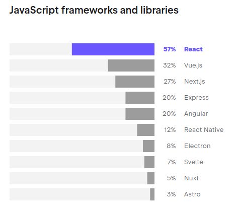

# Introduction to React.js
We are now in the last stage of our journey to become front-end developers. Congratulations for having reached this far!
We have already learned the tools to provide our websites with a great user experience, which implies that they are asthetically pleasing,
they are well organized and users can get what they want from the website in a fast and simple way.
Now we will learn a new tool that will help us very much in reaching our goal: a javascript library originally created by Facebook called React
## Goals
* We will start the implementation of an UI following a serie of steps to decide how to add interactivity. 
First we will use only javascript and they we will do the same using React
* We will review the reasons why React is a great tool for front-end development
* We will learn:
    1. How to start a React project
    2. How files are structured inside it
    3. How components are created and managed
    4. What are component props and to use them

## Implementing an UI
Given the following screen:

<div style="display: flex">
        
</div>

Let's follow the following steps to implement it:
    1. Break the UI into elements    
    2. Build the html version    
    3. Define interactivity: triggers, events and data that changes (state)    
    4. Add interactivity   
### Using JavaScript
Give it a try for yourself. Use what you have learned so far about the DOM (Document Object Model).    
As a quick reminder, for this html:

```javascript
<!DOCTYPE html>
<html lang="en">

<head>
    <title>Page Title</title>
</head>

<body>
    <h1>"My first heading</h1>
    <p>"My first paragraph"</p>
</body>

</html>
```
the DOM tree chart is this:

<details>
    <summary style="line-height: 1.8rem; margin-block-end: 1.8rem"> <span style="font-weight: 800">One possible implementation</span> (Check only after you have tried for yourself ;-)
    </summary>
    <a href="https://stackblitz.com/edit/stackblitz-starters-jmezyd?file=index.html" target="_blank">Javascript Implementation </a>
</details>

## Using React
1. Setting up the development environment (Node.js, npm, vite)
2. Understanding JSX (JavaScript XML)
3. Components and Props

### Creating our first project
Is Node installed in your computer?
If you are not sure type this in your terminal
```bash
node --version
```
If you get something similar to this:
```bash
bash: node: command not found
```
Then proceed to [Node site](https://nodejs.org) and follow the instructions for yor OS.
Having confirmed that Node is install, proceed to create your first React porject with the command:
```bash
npm create vite@latest
```
Answer the prompts like this:
* Project name: react-mfr
* Select a framework: React
* Select a variant: Javascript
and then execute:
```bash
cd mfrReact
npm install 
npm run dev
```
### Reviewing how the project is structured
First file we are going to study is `index.html` at the root:
```html
<!doctype html>
<html lang="en">
  <head>
    <meta charset="UTF-8" />
    <link rel="icon" type="image/svg+xml" href="/vite.svg" />
    <meta name="viewport" content="width=device-width, initial-scale=1.0" />
    <title>Vite + React</title>
  </head>
  <body>
    <div id="root"></div>
    <script type="module" src="/src/main.jsx"></script>
  </body>
</html>
```
As you can see, inside `body` there is only one html element, a div with id root and a script tag that has `src/main.jsx` as source.
So let's review that directory and file:
```javascript
//src/main.jsx
import React from 'react'
import ReactDOM from 'react-dom/client'
import App from './App.jsx'
import './index.css'

ReactDOM.createRoot(document.getElementById('root')).render(
  <React.StrictMode>
    <App />
  </React.StrictMode>,
)
```

Let's break this code down step-by-step:

* `ReactDOM.createRoot(_document_.getElementById('root'))`:
    * `ReactDOM` is a library provided by React that allows us to interact with the browser's DOM (Document Object Model).
    * `createRoot()` is a method from ReactDOM that creates a "root" for our React application. This root is where our React components will be rendered.
    * `_document_.getElementById('root')` is selecting an HTML element on the web page with the ID "root". This is where our React application will be mounted and displayed.
* `.render()`:
    * The `render()` method is used to actually render our React application to the DOM.
    * Whatever we pass as an argument to `render()` will be what gets displayed in the "root" element we selected earlier.
* `<React.StrictMode>` and `<App />`:
    * `<React.StrictMode>` is a special React component that adds additional checks and warnings to help identify potential issues in the application.
    * `<App />` is the top-level component of our React application. This is where the main logic and structure of our app is defined.

Now, let's dive deeper into the `<App />` component in the code snippet.
The `<App />` is a functional component in React. This means that it's a JavaScript function that returns JSX code, which is a syntax extension for JavaScript that allows you to write HTML-like code in your JavaScript files.
Previous React versions also included [class components](https://react.dev/reference/react/Component#defining-a-class-component). Currently there are considered legacy (not used in new project although new versions keep compatibility) 
```javascript
// In javascript we can define functions like this
function app({title, description}){
    // body of the function
}
// In React, a component is a function that returns a JSX object.
// Its should always be an uppercase letter (PascalNotation)
function App({title, description}{
    return {
        // JSX
    }
})
// and when it's invoked instead of using app("Title", "Description"), you do:
<App title="Title" description="Description"/>
```

In JSX, the way we define attributes on HTML-like elements is slightly different from regular HTML. For example, instead of using the `class` attribute, we would use `className` in JSX. This is because `class` is a reserved keyword in JavaScript, so React uses `className` to avoid any conflicts.

Here's an example of how we might use `className` in the `<App />` component:

```javascript
function App(props) {
  return (
    <div className="app-container">
      <h1 className="app-title">{props.title}</h1>
      <p className="app-description">{props.description}</p>
    </div>
  );
}
```

In React, components can accept parameters, called "props", that allow you to pass data into the component. These props can be accessed within the component function and used to dynamically render the component's content.
So, the `<App />` component could be defined like this:

```javascript
function App(props) {
  // Access props here and use them to render the component
  return (
    <div>
      <h1>{props.title}</h1>
      <p>{props.description}</p>
    </div>
  );
}
```

In this example, the `App` component accepts `props` as a parameter, which could contain properties like `title` and `description`. These props can then be used inside the component's JSX code to dynamically render the content.

The JSX syntax used in the `return` statement of the `App` component allows you to write HTML-like code directly in your JavaScript files. This makes it easier to visualize and reason about the structure of your UI components.

When the `<App />` component is rendered, React will replace the JSX code with the corresponding HTML elements in the browser's DOM, creating the actual user interface.

So, in the context of the original code snippet, the `<App />` component is the main entry point of the React application, and it can accept any necessary props to customize its behavior and appearance.
### Composition
In React, the "children" refer to the content that is enclosed between the opening and closing tags of a component. This content can be other React components, HTML elements, or even plain text.
```javascript
function MyComponent() {
  return (
    <div>
      <h1>This is the MyComponent</h1>
      <p>And this is some content inside the component.</p>
      <AnotherComponent />
    </div>
  );
}

function AnotherComponent() {
  return (
    <div>
      <h2>This is another component</h2>
      <p>This component is being used as a child of MyComponent.</p>
    </div>
  );
}
```

In this example, the `<AnotherComponent />` is being used as a child of the `<MyComponent />`. The content between the opening and closing tags of `<MyComponent />` is considered the "children" of that component.

The children concept in React is powerful because it allows you to create reusable and composable components. WE can build components that accept and render other components as their children, enabling us to create complex user interfaces by combining smaller, more focused components.

This flexibility in composing components is a key feature of React and helps promote the creation of modular, maintainable, and scalable user interfaces.

Now it's __your turn__ to implement the UI with React using composition and props.
<details>
    <summary style="line-height: 1.8rem; margin-block-end: 1.8rem"> <span style="font-weight: 800">One possible implementation</span> (Check only after you have tried for yourself ;-)
    </summary>
    <a href="https://stackblitz.com/edit/vitejs-vite-ba3ki8?file=index.html" target="_blank">React Implementation </a>
</details>
Next class you will learn how to add interactivity with hooks.

## Additional Info
### What is React

According to [JetBrains' State of Developer Ecosystem 2023 Survey](https://www.jetbrains.com/lp/devecosystem-2023/), React is the [top library](https://www.jetbrains.com/lp/devecosystem-2023/javascript/) used by JavaScript developers
[](https://www.jetbrains.com/lp/devecosystem-2023/javascript/)
# Why React became the most popular solution to design interactive interfaces?
<video poster="../../../static/1.png" src="../../../static/video1.mp4" style="width: 100%" controls></video>

Christopher Chedeau, Front-end Engineering Manager at Facebook recalls a time before joining the company when he worked on a project for World of Warcraft, which required searching through 20,000 guilds. He spent months optimizing performance to display changes in real-time when filters were adjusted. However, when he tried React, he was able to rewrite the same functionality in about half an hour, and the performance was comparable.
## React19
A new version, React19, is already available for testing and will include very interesting features such as server actions. The release date is expected to be later this year. More info [here](https://www.freecodecamp.org/news/new-react-19-features/)
### References
[React Documentation](https://react.dev)


